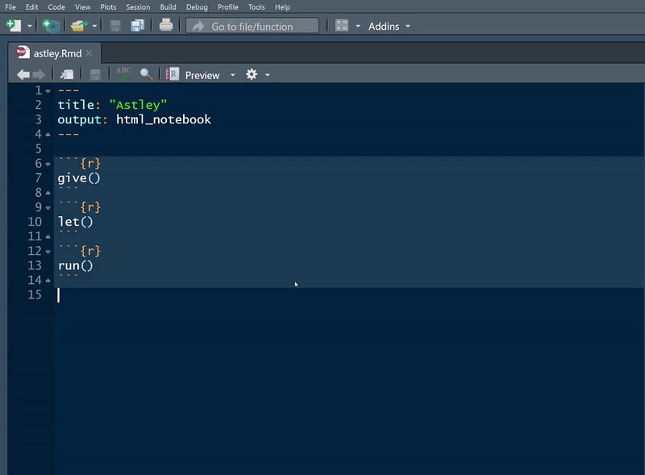
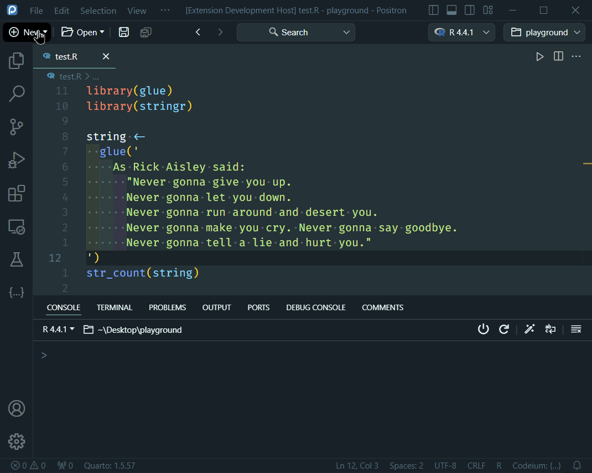

<!-- README.md is generated from README.Rmd. Please edit that file -->

```{r setup, include=FALSE}
library(pedant)

test_dir <- file.path(tempdir(), "testing")
dir.create(test_dir)

knitr::opts_knit$set(
  root.dir = test_dir
)
```

<!-- badges: start -->
[](https://github.com/wurli/pedant/actions)
<!-- badges: end -->

# {pedant} 
`{pedant}` lets you quickly transform R code to *pedantically* use explicit
function calls instead of implicit, either by running `add_double_colons()` or
using the handy RStudio/Positron addin `"Make function calls explicit"`.

{width=75%}

{width=75%}

# Installation
You can install the development version using
``` r
remotes::install_github("wurli/pedant")
```
For **Positron extension**, go to [Releases](https://github.com/wurli/pedant/releases/), download the latest `.vsix` file, and install it as described [here](https://code.visualstudio.com/docs/editor/extension-marketplace#_install-from-a-vsix).

# Usage
If you're developing a package, `{pedant}` will look at the `DESCRIPTION` and
`NAMESPACE` files to work out which packages to use when making functions 
explicit. Otherwise it will use the currently attached packages, i.e.
the ones already loaded using `library()`. You can manually specify the
packages to look in using the `use_packages` argument to `add_double_colons()`:
```{r}
library(dplyr, warn.conflicts = FALSE)

code <-
  "mtcars %>%
    filter(mpg > 20) %>%
    summarise(across(everything(), n_distinct))"

# Code will be transformed to use the double-colon operator, but notice
# that `n_distinct` is not transformed as it is not followed by `()`
cat(add_double_colons(code))
```

# Positron Extension
> ⚠ The extension is designed to work ONLY in [Positron](https://github.com/posit-dev/positron) IDE, as it heavily depends on the Positron API. It **will not work** in VS Code or any other IDE based on Code-OSS.

Currently, it has only two functions:  
- `pedant.makeRFunctionCallExplicit`: transforms R code in the selection.  
- `pedant.installPedant`: installs dependencies, i.e., the [`{pedant}`](https://github.com/wurli/pedant) R package. It requires the [`{pak}`](https://github.com/r-lib/pak) pacakge to be installed and {pedant} version at least `v0.1.1` to work.

Capturing output from the Positron Console, given the limitations of the Positron/VS Code environment, requires creative solutions since there is no known API to intercept console output. The current approach is to write the `{pedant}` output to a temporary file and then read it back into Positron. Therefore, a line of code (as it shown on the demo gif) will always appear in the R console indicating the temporary file containing the `{pedant}` output, which deletes itself after being read.

# Why?
Often, during package development I forget to use explicit function calls and
am then faced with the onerous task of cleaning up my own code. I wrote this
package so I can continue this bad habit.

# Bug reports / feature requests
Please post these as issues on [github](https://github.com/wurli/pedant/issues)
