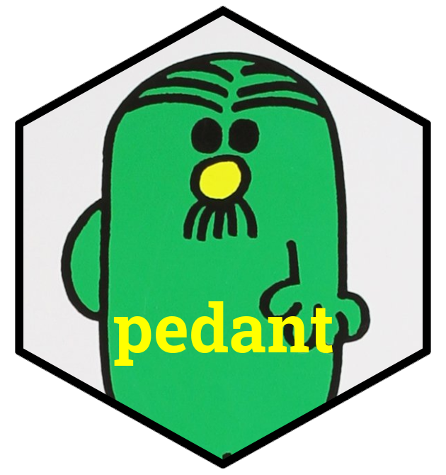

<!-- README.md is generated from README.Rmd. Please edit that file -->

```{r setup, include=FALSE}
library(pedant)

test_dir <- file.path(tempdir(), "testing")
dir.create(test_dir)

knitr::opts_knit$set(
  root.dir = test_dir
)
```

<!-- badges: start -->
[](https://github.com/wurli/pedant/actions)
<!-- badges: end -->

# {pedant} 
`{pedant}` lets you quickly transform R code to *pedantically* use implicit
function calls instead of implicit, either by running `add_double_colons()` or
using the handy RStudio addin `"Make function calls explicit"`.

{width=75%}

# Installation
You can install the development version using
``` r
remotes::install_github("wurli/pedant")
```

# Usage
If you're developing a package, `{pedant}` will look at the `DESCRIPTION` and
`NAMESPACE` files to work out which packages to use when making functions 
explicit. Otherwise it will use the currently attached packages, i.e.
the ones already loaded using `library()`. You can manually specify the
packages to look in using the `use_packages` argument to `add_double_colons()`:
```{r}
library(dplyr, warn.conflicts = FALSE)

code <- 
 "mtcars %>%
    filter(mpg > 20) %>%
    summarise(across(everything(), n_distinct))"

# Code will be transformed to use the double-colon operator, but notice
# that `n_distinct` is not transformed as it is not followed by `()`
cat(add_double_colons(code))
```

# Why?
Often, during package development I forget to use explicit function calls and
am then faced with the onerous task of cleaning up my own code. I wrote this
package so I can continue this bad habit.

# Bug reports / feature requests
Please post these as issues on [github](https://github.com/wurli/pedant/issues)
